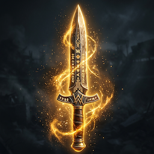

<div align="center">
  
  <h1>OpenDagger</h1>
  <p><strong>Open-source multi-agent orchestration framework built on LangChain.</strong></p>

  [](https://pypi.org/project/opendagger/)
  [](LICENSE)
  [](https://www.python.org/)
  [](https://langchain.com)

  <br/>

  **[Install](#install) · [Quick Start](#quick-start) · [Core Concepts](#core-concepts) · [Features](#features) · [Compare](#how-does-opendagger-compare) · [Contributing](#contributing)**

</div>

---

  
  
## What is OpenDagger?

OpenDagger lets you define **autonomous AI agents**, assign them **tasks**, and orchestrate them into collaborative pipelines — called **Daggers** — with minimal boilerplate.

Every agent is a LangChain `AgentExecutor` under the hood, so every LangChain tool, memory module, callback, and LLM works out of the box.

```python
from opendagger import Agent, Task, Dagger

researcher = Agent(role="Research Analyst", goal="Find accurate information", llm="gpt-4o")
writer     = Agent(role="Content Writer",  goal="Write clear summaries",      llm="gpt-4o")

research = Task(description="Research quantum computing trends.", agent=researcher)
article  = Task(description="Write a blog post from the research.", agent=writer, context=[research])

result = Dagger(agents=[researcher, writer], tasks=[research, article]).run()
print(result)
```

---

## Demo

<div align="center">
  
  <br/>
  <sub>A two-agent pipeline: Research Analyst → Content Writer, orchestrated by a Dagger.</sub>
</div>

> **Tip:** To embed a video walkthrough, upload an `.mp4` to a GitHub release and paste the URL into a `<video>` tag here — GitHub renders `<video>` natively in README files.

---

## Install

```bash
pip install opendagger
```

Set your LLM key:

```bash
export OPENAI_API_KEY="sk-..."
# or use a .env file with python-dotenv
```

---

## Quick Start

### 1 — Define your agents

```python
from opendagger import Agent, Task, Dagger

search_tool = DuckDuckGoSearchRun()

researcher = Agent(
    role="Research Analyst",
    goal="Find accurate, up-to-date information on the given topic",
    backstory="You are a meticulous analyst who never guesses.",
    tools=[search_tool],
    llm="gpt-4o"
)

writer = Agent(
    role="Content Writer",
    goal="Write clear and engaging summaries",
    backstory="You turn complex research into readable prose.",
    llm="gpt-4o"
)
```

### 2 — Define tasks

```python
research_task = Task(
    description="Research the latest developments in quantum computing.",
    expected_output="A bullet-point summary of key findings.",
    agent=researcher
)

write_task = Task(
    description="Write a short blog post based on the research.",
    expected_output="A 300-word blog post.",
    agent=writer,
    context=[research_task]   # receives output of research_task
)
```

### 3 — Assemble and run the Dagger

```python
dagger = Dagger(
    agents=[researcher, writer],
    tasks=[research_task, write_task],
    process="sequential",   # or "parallel"
    verbose=True
)

result = dagger.run()
print(result)
```

---

## Core Concepts

| Primitive | Description |
|---|---|
| **Agent** | An autonomous actor with a role, goal, backstory, and a set of tools. Agents reason, plan, and act using LangChain under the hood. |
| **Task** | A discrete unit of work assigned to an Agent. Tasks have a description, expected output, and optional context from prior tasks. |
| **Dagger** | The orchestrator — equivalent to a "Crew". A Dagger defines which Agents exist, which Tasks they run, and in what order (sequential or parallel). |
| **Tool** | A callable capability given to an Agent — web search, file I/O, API calls, code execution, or any custom LangChain tool. |

---

## Features

| Feature | Details |
|---|---|
| **LangChain Native** | Every Agent is a LangChain `AgentExecutor`. All LangChain tools, memory, and callbacks work out of the box. |
| **Sequential & Parallel Execution** | Run tasks one after another or fan out in parallel — configured per Dagger. |
| **Role-Based Agents** | Give each agent a role, goal, and backstory. The LLM uses this context to stay on task and reason appropriately. |
| **Multi-LLM Support** | Plug in any LangChain-compatible LLM — OpenAI, Anthropic Claude, Ollama (local), Groq, Mistral, and more. |
| **Memory & Context Passing** | Task outputs feed automatically into subsequent tasks. Agents share short-term and long-term memory via LangChain memory modules. |
| **Custom Tools** | Extend agents with any Python callable or LangChain `BaseTool`. Built-in tools for web search, file read/write, and shell execution included. |
| **Async & Streaming** | Run Daggers asynchronously. Stream token output from agents for real-time UIs. |
| **Human-in-the-Loop** | Pause a Dagger at any task and wait for human approval or input before proceeding. |
| **Callbacks & Observability** | Full LangChain callback compatibility — plug in LangSmith, Weights & Biases, or any custom callback handler. |
| **Minimal Config** | A working multi-agent pipeline in under 20 lines of Python. No YAML required. |

---

## What Can You Build?

| Use Case | Description |
|---|---|
| **Research Assistant** | Multiple agents gather, cross-check, and summarize information from the web. |
| **Code Review Pipeline** | Agents analyze pull requests, run static analysis tools, and write reviewer comments. |
| **Content Generation** | A researcher and a writer agent collaborate to produce SEO blog posts end-to-end. |
| **Data Extraction** | Agents scrape, clean, and structure data from unstructured sources into JSON or CSV. |
| **Customer Support Bot** | A triage agent classifies tickets; specialized agents resolve them in parallel. |
| **Report Automation** | Agents pull data from APIs, perform analysis, and generate formatted PDF reports. |

---

## How Does OpenDagger Compare?

| Feature | OpenDagger | CrewAI | Raw LangChain |
|---|:---:|:---:|:---:|
| LangChain Native | ✅ | Partial | ✅ |
| Multi-Agent Orchestration | ✅ | ✅ | Manual |
| Parallel Execution | ✅ | ✅ | Manual |
| Role-Based Agents | ✅ | ✅ | Manual |
| Human-in-the-Loop | ✅ | ✅ | Manual |
| Memory Modules | LangChain native | Custom | LangChain native |
| Streaming Support | ✅ | Limited | ✅ |
| Open Source / MIT | ✅ | ✅ | ✅ |
| No Cloud Required | ✅ | ✅ | ✅ |
| Setup Complexity | Low | Low | High |

---

## Contributing

PRs are welcome. Check out [`good-first-issue`](../../issues?q=is%3Aissue+is%3Aopen+label%3Agood-first-issue) labels for a starting point.

```bash
git clone https://github.com/your-org/opendagger
cd opendagger
pip install -e ".[dev]"
```

Please read [CONTRIBUTING.md](CONTRIBUTING.md) before submitting.

---

## License

MIT — see [LICENSE](LICENSE) for details.

<div align="center">
  <sub>Built on <a href="https://langchain.com">LangChain</a> · Made by OpenDagger! 🗡️</sub>
</div>
